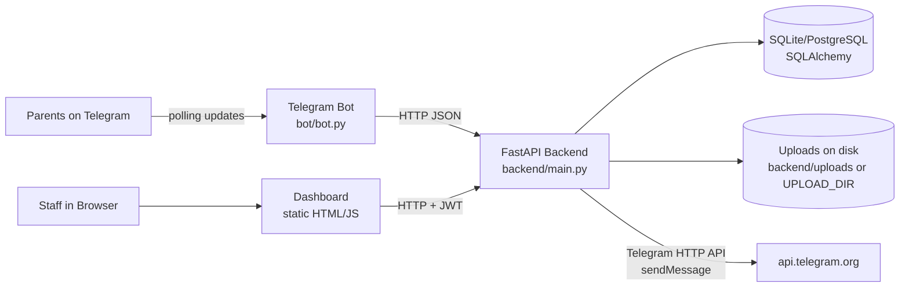
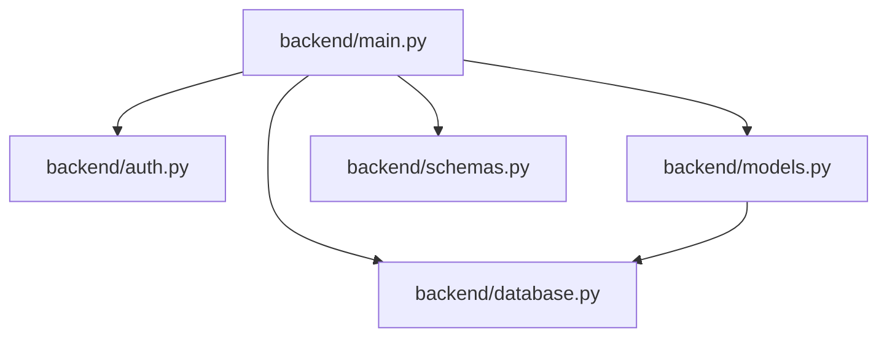

# SmartEdu Bot — Code Wiki

## 1) What This Repository Is

This project is a school communication system with three user-facing surfaces:

- **Telegram bot (parents)**: parents register a class, then view homework and holidays and receive broadcast announcements.
- **Web dashboard (staff)**: teachers submit homework; admins manage classes, holidays, and broadcasts.
- **FastAPI backend (system of record)**: REST API + database + file uploads + optional Telegram broadcast delivery.

Primary references:

- [README.md](README.md)
- [STEERING.md](STEERING.md)

## 2) Architecture Overview

### 2.1 Component Diagram



### 2.2 “Source of Truth” Rule

The backend owns persistence and business rules. Both the bot and dashboard are thin clients that call backend endpoints rather than duplicating domain logic (see [STEERING.md](STEERING.md)).

### 2.3 Runtime Modes

- **Recommended for local dev**: run backend + bot as separate processes.
- **Optional**: start the bot inside the backend process by setting `RUN_BOT=true` (backend spawns a thread in the FastAPI lifespan hook).

## 3) Repository Layout

```
SmartEdu_bot-main/
├─ backend/                FastAPI server, DB models, auth, uploads
├─ bot/                    Telegram bot (python-telegram-bot)
├─ dashboard/              Static dashboard (HTML/CSS/JS, no build step)
├─ README.md               Quick start + deployment notes
├─ STEERING.md             Architecture principles + risks + runbook
└─ CODE_WIKI.md            This document
```

## 4) Backend (FastAPI) — Module Responsibilities

### 4.1 `backend/main.py` (API routes + integrations + static hosting)

File: [backend/main.py](backend/main.py)

Responsibilities:

- Creates the FastAPI app and configures CORS.
- Loads environment variables (both `backend/.env` and repository root `.env`).
- Initializes DB tables on import (`models.Base.metadata.create_all(...)`).
- Implements all REST endpoints (auth, classes, homework, holidays, subscribers, broadcast).
- Manages file upload validation + persistence (extension allowlist + max size).
- Optionally starts the Telegram bot in a background thread via `RUN_BOT=true`.
- Serves the dashboard as static assets (`/static`) and `GET /` returns `dashboard/index.html`.

Notable implementation details:

- Duplicate function definition: `run_bot()` exists twice in the file ([backend/main.py](backend/main.py)). The second definition overwrites the first at import-time.
- Login endpoint prints credentials to stdout:
  - `print(f"[LOGIN] username={repr(...)} password={repr(...)}")` in [backend/main.py](backend/main.py). Treat this as a security risk for any non-local environment.

#### Endpoint Map (by feature)

- **Auth**
  - `POST /api/auth/login` (JWT issuance)
- **Classes**
  - `GET /api/classes` (public; used by bot class picker)
  - `POST /api/classes` (admin)
  - `DELETE /api/classes/{class_id}` (admin)
- **Homework**
  - `POST /api/homework` (authenticated; multipart form; optional file upload)
  - `GET /api/homework/{class_code}` (public; bot reads homework)
  - `GET /api/homework/{homework_id}/file` (public; downloads attachment)
  - `DELETE /api/homework/{homework_id}` (authenticated)
- **Holidays**
  - `GET /api/holidays` (public; bot reads holidays)
  - `POST /api/holidays` (admin)
  - `DELETE /api/holidays/{holiday_id}` (admin)
- **Subscribers** (bot-managed registration + dashboard visibility)
  - `POST /api/subscribers` (public; bot “upserts” on `/start`)
  - `GET /api/subscribers/count` (authenticated)
  - `GET /api/subscribers` (admin)
  - `GET /api/subscribers/{telegram_id}` (public; bot reads subscriber preferences)
  - `PATCH /api/subscribers/{telegram_id}/class` (public; bot updates class)
  - `PATCH /api/subscribers/{telegram_id}/language` (public; bot updates language)
- **Broadcast**
  - `POST /api/broadcast` (admin; sends Telegram messages and logs)
  - `GET /api/broadcast/history` (admin)
  - `DELETE /api/broadcast/history` (admin)
- **Health**
  - `GET /health` and `HEAD /health`

### 4.2 `backend/auth.py` (JWT auth + admin gating)

File: [backend/auth.py](backend/auth.py)

Responsibilities:

- Reads `ADMIN_USERNAME` / `ADMIN_PASSWORD` from environment at runtime.
- Authenticates credentials (`authenticate_user`).
- Issues JWT access tokens (`create_access_token`) signed with `API_SECRET_KEY`.
- Validates bearer token on API requests (`get_current_user`).
- Enforces admin-only routes (`require_admin`).

Key functions:

- `_get_users()`: builds a single-user credential map from env.
- `authenticate_user(username, password)`: returns `{"username", "role"}` or `None`.
- `get_current_user(token)`: decodes token, returning a dict with `username` and `role`.
- `require_admin(current_user)`: raises 403 unless `role == "admin"`.

### 4.3 `backend/database.py` (engine/session + DB selection)

File: [backend/database.py](backend/database.py)

Responsibilities:

- Loads `DATABASE_URL` from environment.
- Normalizes `postgres://` → `postgresql://` for SQLAlchemy compatibility.
- Falls back to SQLite (`sqlite:///./school.db`) when `DATABASE_URL` is unset.
- Creates SQLAlchemy engine + `SessionLocal`.
- Exposes dependency `get_db()` for FastAPI routes.

### 4.4 `backend/models.py` (SQLAlchemy ORM tables)

File: [backend/models.py](backend/models.py)

Tables:

- `Class`: class/grade entity (`name`, `code`), with relationship:
  - `Class.homework` (cascade delete-orphan)
- `Homework`: assignment, optionally with file metadata (`file_name`, `file_path`)
- `Holiday`: holiday/closure records
- `Subscriber`: Telegram user registration (`telegram_id`, `class_code`, `language`, `is_active`)
- `BroadcastLog`: broadcast message history (`message`, `sent_by`, `recipient_count`, `sent_at`)

Relationship summary:

- `Class (1) -> (many) Homework` via `Homework.class_id`

### 4.5 `backend/schemas.py` (Pydantic DTOs / API contracts)

File: [backend/schemas.py](backend/schemas.py)

Responsibilities:

- Defines request/response shapes used by `backend/main.py`.
- Enables ORM response serialization via `model_config = {"from_attributes": True}`.

Notable schemas:

- `TokenResponse` (login result): `access_token`, `token_type`, `role`
- `ClassCreate`, `ClassOut`
- `HomeworkOut` includes `file_url` (full URL built in API)
- `SubscriberUpsert`, `SubscriberOut`, `SubscriberSetClass`, `SubscriberSetLanguage`
- `BroadcastRequest`, `BroadcastResult`

## 5) Telegram Bot — Module Responsibilities

### 5.1 `bot/bot.py` (conversation/controller + backend API client)

File: [bot/bot.py](bot/bot.py)

Responsibilities:

- Implements the Telegram UI with `python-telegram-bot` (async, polling).
- Stores short-term session state in `context.user_data` (language cache).
- Persists long-term user preferences (class, language) in the backend via HTTP.
- Renders messages using translation keys from `bot/translations.py`.

Key config:

- `TELEGRAM_BOT_TOKEN` (required)
- `API_BASE_URL` (defaults to `http://localhost:8000`)
- `SCHOOL_NAME` (used in About text)

Key functions:

- API wrappers:
  - `api_get(path)`, `api_post(path, data)`, `api_patch(path, data)`
- Subscriber persistence:
  - `register_subscriber(user)` → `POST /api/subscribers`
  - `get_subscriber(telegram_id)` → `GET /api/subscribers/{telegram_id}`
  - `save_class(telegram_id, class_code)` → `PATCH /api/subscribers/{id}/class`
  - `save_language(telegram_id, language)` → `PATCH /api/subscribers/{id}/language`
- UI flow:
  - `start(...)`: registers subscriber, loads stored language/class, routes to picker vs main menu
  - `button_handler(...)`: routes callback queries (language selection, class selection, homework, holidays, about, back)
  - `show_homework(...)`: fetches homework list and optionally downloads/sends attachments
  - `show_holidays(...)`
- Entrypoint:
  - `main()` builds `Application`, registers handlers, and runs polling

Conversation states:

- `PICKING_LANG` → callback data `lang:en` / `lang:km`
- `PICKING_CLASS` → callback data `pick:{CLASS_CODE}`

### 5.2 `bot/translations.py` (i18n strings + formatter)

File: [bot/translations.py](bot/translations.py)

Responsibilities:

- Centralizes all user-facing strings in English and Khmer.
- Provides `t(key, lang, **fmt)` to select language and format placeholders.

## 6) Dashboard (Static Web UI) — Module Responsibilities

### 6.1 `dashboard/index.html` (UI structure)

File: [dashboard/index.html](dashboard/index.html)

Responsibilities:

- Defines login view + dashboard layout with tabs (homework, holidays, broadcast, classes, users).
- Loads `/static/app.js` and `/static/style.css` when served by backend.

### 6.2 `dashboard/app.js` (frontend controller + API client)

File: [dashboard/app.js](dashboard/app.js)

Responsibilities:

- Determines API base:
  - If opened as a local file (`file:`) it calls `http://localhost:8000`
  - Otherwise it uses `window.location.origin` (works when served by FastAPI)
- Performs login via `POST /api/auth/login` (form-encoded).
- Stores token + role in `localStorage`.
- Wraps authenticated requests via `apiFetch(...)` (adds `Authorization: Bearer ...`).
- Implements CRUD UI flows that map directly to backend endpoints.

Key functions:

- `apiFetch(path, options)`: attaches JSON headers and bearer token.
- `escapeHtml(value)`: HTML-escapes dynamic content before inserting into the DOM.
- `enterDashboard()`: loads initial data and hides admin-only tabs for non-admin users.

## 7) Dependency Relationships

### 7.1 Inter-Component Dependencies

- **Bot → Backend**: `bot/bot.py` calls backend endpoints for classes, subscriber state, homework, holidays.
- **Dashboard → Backend**: `dashboard/app.js` calls backend endpoints for login and CRUD operations.
- **Backend → Database**: SQLAlchemy via `backend/database.py` and ORM models in `backend/models.py`.
- **Backend → Telegram**:
  - Broadcasts are sent directly by the backend using the Telegram HTTP API (`sendMessage`).
  - The bot itself connects to Telegram via `python-telegram-bot` (polling).

### 7.2 Backend Module Imports



### 7.3 Third-Party Libraries (declared in requirements)

- Backend: [backend/requirements.txt](backend/requirements.txt)
  - FastAPI, Uvicorn, SQLAlchemy, python-dotenv, httpx, python-jose, passlib[bcrypt], python-multipart, aiofiles, psycopg2-binary
- Bot: [bot/requirements.txt](bot/requirements.txt)
  - python-telegram-bot, httpx, python-dotenv

## 8) Configuration (Environment Variables)

The project expects a repository-root `.env` file. The README references `.env.example`, but `.env.example` is not currently present in the repository (create `.env` manually).

Common variables:

- `TELEGRAM_BOT_TOKEN` (bot + backend broadcast; required for bot and broadcast)
- `API_BASE_URL` (bot: backend URL; backend: used to build `file_url` links; also used by keep-alive ping)
- `API_SECRET_KEY` (backend JWT signing secret)
- `ADMIN_USERNAME`, `ADMIN_PASSWORD` (dashboard login)
- `DATABASE_URL` (optional; defaults to SQLite `backend/school.db`)
- `SCHOOL_NAME` (bot About text)
- `RUN_BOT` (backend: start embedded bot thread when `true`)
- `UPLOAD_DIR` (backend: where homework attachments are stored)

## 9) Running the Project (Local Development)

### 9.1 Prerequisites

- Python 3.11+ (repo includes `runtime.txt` files for backend and bot)
- A Telegram bot token from @BotFather

### 9.2 Create `.env` (Repository Root)

Minimal example:

```env
TELEGRAM_BOT_TOKEN=your_token_here
API_BASE_URL=http://localhost:8000
API_SECRET_KEY=change-me-to-a-long-random-string
ADMIN_USERNAME=admin
ADMIN_PASSWORD=change-me
SCHOOL_NAME=Our School
```

### 9.3 Start Backend

From repository root:

```bash
cd backend
pip install -r requirements.txt
uvicorn main:app --reload --port 8000
```

- API base: `http://localhost:8000`
- OpenAPI docs: `http://localhost:8000/docs`

### 9.4 Start Telegram Bot (Recommended Separate Process)

From repository root (second terminal):

```bash
cd bot
pip install -r requirements.txt
python bot.py
```

### 9.5 Open Dashboard

Options:

- Served by backend: `http://localhost:8000/`
- Or open `dashboard/index.html` directly (it will call `http://localhost:8000`)

## 10) Operational Notes / Known Risks

Based on [STEERING.md](STEERING.md) and current code:

- **Duplicate `run_bot()` definition**: remove/merge to avoid confusion.
- **Credential logging**: login currently prints the submitted password to stdout in the backend.
- **Permissive CORS**: backend allows `allow_origins=["*"]` (fine for local dev, risky for production).
- **JWT storage**: dashboard stores JWTs in `localStorage` (common for simple apps but increases XSS impact).
- **Public file downloads**: `GET /api/homework/{id}/file` is unauthenticated; decide whether that matches desired access controls.

## 11) Extending the System (Practical Guide)

- **Add a new backend feature**
  - Define/extend Pydantic schemas in [backend/schemas.py](backend/schemas.py)
  - Add endpoints in [backend/main.py](backend/main.py)
  - Add/modify ORM models in [backend/models.py](backend/models.py) (and consider migrations if moving beyond `create_all`)
  - Wire the dashboard through `apiFetch()` in [dashboard/app.js](dashboard/app.js) so JWT handling stays consistent
  - Wire the bot by adding a menu button / callback branch in [bot/bot.py](bot/bot.py) and new translation keys in [bot/translations.py](bot/translations.py)

